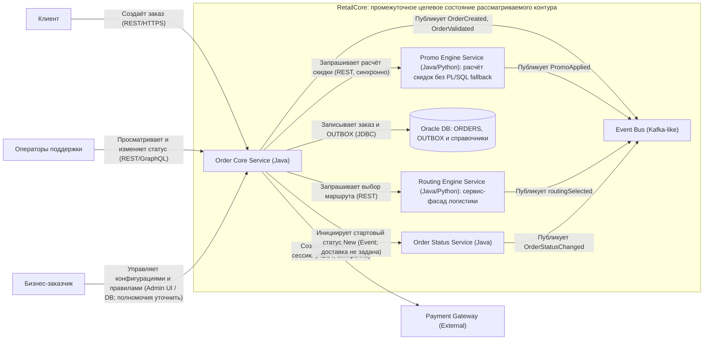

# transformation.md — описание трансформации и целевой архитектуры

## 0. Паспорт документа

| Поле | Значение |
|---|---|
| Название проекта | Трансформация платформы обработки заказов RetailCore |
| Бизнес-сценарий | Приём и обработка заказа: расчёт скидки, выбор доставки, создание платёжной сессии, сохранение заказа, управление состоянием и публикация связанных событий. Точный набор каналов и исключений первого этапа не определён. |
| Горизонт целевой архитектуры | Первый релиз / пилот — изолировать ядро заказа, ввести событийный слой и сервис‑фасад для логистики |
| Автор | Сизов Иван |
| Дата | 10.10.2026 |
| Версия | 1 |
| Связанные документы | Описание компании RetailCore; `AS-IS.puml`; краткий анализ технических интервью и `OrderProcessingService`; рисунок «RetailCore — целевое intermediate-состояние». Решение о роли routingEngine Service как сервис-фасада логистики фиксирую в этом документе. `migration-roadmap.md` и `cutover-plan.md` отсутствуют в текущем наборе артефактов; ссылки на утверждённые планы отсутствуют. |

## 1. Краткое резюме трансформации

RetailCore должна быстрее адаптироваться к требованиям бизнеса, поддерживать рост нагрузки и более предсказуемо обрабатывать заказы. В текущем состоянии этому мешают нечёткие границы областей, дублирование логики, неоднородные интеграции и зависимость от централизованной Oracle.

Для первого этапа выбирано три точки трансформации:
- изоляция ядра заказа, 
- введение событийного слоя,
- выделение фасада логистики. 

## 2. Бизнес-цель и критерии успеха

| Элемент | Описание |
|---|---|
| Бизнес-цель | Ускорить адаптацию платформы, сделать обработку заказов более предсказуемой и подготовить основу для новых сервисов, каналов и партнёрских сценариев. Эти направления заданы описанием компании; их количественные цели не установлены. |
| Пользовательская ценность | Ожидаемое улучшение — более устойчивое оформление и обработка заказа без нарушения согласованных условий оплаты и доставки. Конкретные обещания клиенту и допустимые отклонения требуют уточнения у руководителя команды заказов и оформления. |
| Операционный эффект | В качестве проверяемой гипотезы принимаю уменьшение числа изменений ядра при доработке логистики и получение более связной картины обработки через события. Сокращение ручных действий и времени разбора не гарантировано одним введением фасада или шины. |
| Горизонт проверки | Через 3 мес после выпуска первой ветки (ядро и шина событий) собрать метрики и сравнить с базой; через 6 мес — добавить Promo Engine и Integration Facade, провести финальную оценку. |
| Ограничения результата | Не меняем процесс оплаты — payment orchestration остаётся в монолите до конца проекта; не мигрируем полностью PL/SQL‑логики, оставляем её только как fallback‑путь. |

### 2.1. Метрики успеха

| Метрика | Базовое значение AS-IS | Целевое значение TO-BE | Источник данных | Частота контроля |
|---|---|---|---|---|
| M-01. Время от согласования типового изменения заказного сценария до выпуска | В исходных материалах нет результатов измерения | Не задано; проверить ожидаемое сокращение для согласованных классов изменений | Предлагаю использовать историю задач и релизов; наличие данных уточнить у руководителя заказов и технического лидера | Не установлена; согласовать с руководителем заказов |
| M-02. Доля изменений логистических правил или интеграций, требующих изменения Order Core | Не измерена | Не задана; проверить уменьшение зависимости от изменений ядра, не обещая её полного устранения | Сопоставление задач, изменений кода и релизов; технический лидер и команда логистики | Не установлена; согласовать с техническим лидером и командой логистики |
| M-03. Полнота публикации согласованного набора событий | Не измерена; события и асинхронные механизмы уже обозначены в AS-IS | Не задана; сначала определить, какое сохранённое бизнес-изменение должно порождать какое событие | Предлагаю сверять результаты операций, записи OUTBOX и события Event Bus; способ сопоставления ещё не определён | Не установлена; согласовать с техническим лидером и эксплуатацией |
| M-04. Задержка от фиксации бизнес-изменения до доступности соответствующего события в Event Bus | Не измерена; точки начала и конца измерения требуют определения | Не задана; допустимую задержку согласовать с владельцами сценариев. p95/p99 предлагаю как способ измерения, а не как установленные требования | Журналы операций и публикации, измерения брокера при наличии; ответственные за ядро и эксплуатацию | Не установлена; согласовать после выбора механизма публикации |
| M-05. Доля технически неуспешных операций оформления и обработки заказа | Не измерена; состав учитываемых операций не согласован | Не задана; допустимое изменение показателя выношу на согласование с бизнесом | Предлагаю использовать результаты запросов, журналы обработки и разборы инцидентов; руководитель заказов и эксплуатация | Не установлена; согласовать для обычного режима, пика и перехода |
| M-06. Задержки оформления и выбора доставки, включая p95/p99 | Не измерены; нагрузочный профиль отсутствует | Не заданы; пороги согласовать отдельно по операциям и профилям нагрузки | Измерения API и внешних ожиданий, результаты разрешённых нагрузочных испытаний; технический лидер и эксплуатация | Не установлена; согласовать с владельцами процесса и эксплуатации |

Для M-03 не считаю отсутствие своевременно опубликованного события доказательством потери: сначала нужны согласованный срок ожидания и состояние публикации.
В M-05 отделяю технические ошибки от штатных бизнес-отказов. 
Численные SLA/SLO, RPS/TPS, RTO/RPO и ограничения задержки оставляю открытыми вопросами раздела 13.

## 3. Краткое описание AS-IS

| Область               | Текущее состояние                                                                                                                                                                                                                                                   | Почему это важно для трансформации                                                                                                                                                                                                |
| --------------------- | ------------------------------------------------------------------------------------------------------------------------------------------------------------------------------------------------------------------------------------------------------------------- | --------------------------------------------------------------------------------------------------------------------------------------------------------------------------------------------------------------------------------- |
| Бизнес-процесс        | По описанию компании оформление включает товары, цену, скидки, доставку и оплату. После оформления выполняются проверки, резервирование и взаимодействие с внешними системами. Жизненный цикл заказа описан, но фактическое поведение содержит отклонения.          | Нельзя выделять ядро только по обычному пути: нужно установить реальные шаги, исключения и владельцев бизнес-правил.                                                                                                              |
| Компоненты            | Checkout / Order API, Order Processing, Pricing & Promo Logic, Status Management, Payment Orchestration и Delivery routing. Вокруг него показаны Oracle, .NET integration service, Python analytics jobs, Async / batch exchange и инструменты поддержки.           | Выделение Order Core и логистического фасада меняет существующие границы ответственности.                                                                                                                                         |
| Промо и маршрутизация | Описание компании указывает на дублирование логики. По краткому анализу технических артефактов промо распределено между кодом, Oracle и сервисами с резервным сценарием; правила маршрутизации — между кодом, конфигурациями и Oracle.                              | Простое добавление нового API не означает переноса правил и прекращения старых путей исполнения. Перечень правил и реальных зависимостей требуется проверить.                                                                     |
| Данные                | Oracle — централизованная БД. UML обозначает в ней также бизнес-логику и staging/shared tables. В описании указаны десятки терабайт накопленных данных и несистемное архивирование. По техническому пересказу часть бизнес-логики выполняется процедурами.          | Изоляция кода не устраняет общие данные автоматически.                                                                                                                                                                            |
| Интеграции            | Есть прямые вызовы, обмен через БД и асинхронные механизмы. UML показывает вызовы платёжного провайдера и служб доставки из монолита, а также логистический путь через .NET-сервис и staging/shared tables.                                                         | Необходимо определить, какие существующие пути будет скрывать Routing Engine и какие будут сохраняться при переходе. Событийный слой вводится не вместо полного отсутствия асинхронности, а поверх неоднородного текущего обмена. |
| Транзакции и повторы  | По краткому анализу `OrderProcessingService` внешние вызовы оплаты и логистики выполняются внутри транзакции оформления; повторные попытки доставки связаны с `RETRY_DELIVERY_QUEUE`. Полный код отсутствует в текущем наборе артефактов; границы требуют проверки. | Перед изменением нужны подтверждённые точки фиксации и правила повторов. Из диаграммы нельзя вывести существование или отсутствие распределённой транзакции.                                                                      |
| Эксплуатация          | UML показывает ручные проверки и корректировки через инструменты поддержки. По техническому пересказу корреляционные идентификаторы используются не везде, цепочку приходится восстанавливать вручную; интеграционные исключения требуют ручного вмешательства.     | Нужно проверить доступность данных для измерений и влияние перехода на разбор заказов.                                                                                                                                            |
| Аналитика             | На UML Python-задания и BI обращаются к Oracle напрямую. По пересказу интервью аналитика есть влияние тяжёлых SQL на операционную БД и неоднородные трактовки заказа. Масштаб влияния не подтверждён метриками.                                                     | Новая шина сама по себе не отключит прямые запросы. Миграция аналитических потребителей не показана в целевом состоянии и не включается в результат этапа автоматически.                                                          |

## 4. Ограничения и допущения

| Тип                                          | Формулировка                                                                                                                                                   | Влияние на архитектуру                                                                                                                                                          |
| -------------------------------------------- | -------------------------------------------------------------------------------------------------------------------------------------------------------------- | ------------------------------------------------------------------------------------------------------------------------------------------------------------------------------- |
| Техническое ограничение выбранного состояния | Oracle сохраняется как хранилище заказа, OUTBOX и справочников.                                                                                                | Полную замену БД нельзя включать в результат этого состояния.                                                                                                                   |
| Инфраструктурное ограничение из описания     | Собственный ЦОД, физические серверы, ограниченная виртуализация, близкие к пределу ресурсы и длительное расширение через закупки.                              | Нельзя предположить свободные мощности для новых сервисов, Event Bus и параллельного запуска. Запрет облака или контейнеров из этого не следует.                                |
| Ограничение перехода из описания             | Требуются поэтапный переход и эволюция без критических рисков для текущих операций.                                                                            | Нужно определить допустимый риск, порядок переключения и условия возврата. Полный запрет любого краткого окна, нулевой RPO или конкретный SLO из этой формулировки не следуют.  |
| Стратегическое направление из описания       | Подготовка к постепенному отказу от Oracle и других зарубежных компонентов.                                                                                    | Сохранение Oracle является промежуточным решением. Конкретная замена, обязательный перечень компонентов и даты не установлены.                                                  |
| Доменное ограничение                         | Не определены обязательные сочетания состояний заказа, оплаты, резерва и доставки, момент подтверждения заказа и допустимость временного рассогласования.      | Нельзя назначать тип консистентности, финансовые компенсации или режим отложенного оформления без решения владельцев процесса, платежей и логистики.                            |
| Граница ответственности                      | Routing Engine Service — сервис-фасад логистики. Рисунок задаёт выбор партнёра и маршрута, работу со справочниками и публикацию `routingSelected`.             | Полный перечень операций с партнёрами, обработка их ответов и способ использования .NET-сервиса остаются неуточнёнными.                                                         |
| Техническая неопределённость                 | Конкретный брокер, конфигурация и выбор языка для каждого такого сервиса не установлены.                                                                       | Нельзя добавлять в план конкретный продукт, размеры кластера, гарантии или обязательный технологический стек, не согласованные проектом.                                        |
| Рабочее допущение                            | Допускаю, что для трёх выбранных точек удастся выделить ограниченный сценарий перехода с сохранением остальных процессов. Это допущение, а не доказанный факт. | Технический лидер и руководитель заказов должны проверить зависимости и границы сценария. При неподтверждении требуется пересмотр объёма первого этапа.                         |
| Рабочее допущение                            | Допускаю возможность получить обезличенные кейсы, код, сведения о БД и метрики для проверки. Доступность не подтверждена.                                      | Уточнить у технического лидера, эксплуатации и ответственного за доступ. При отсутствии данных выводы остаются предварительными, а измеримый эффект не объявляется достигнутым. |

## 5. Препятствия первого релиза

| Препятствие | Где проявляется | Влияние на бизнес / пользователя | Можно изменить сейчас? | Решение |
|---|---|---|---|---|
| Нечёткие границы и переплетение заказной, финансовой и логистической логики | Монолит, Oracle, интеграции; описание компании и технический пересказ | Изменения становятся сложнее и рискованнее; масштаб влияния требует оценки | Выбрано для изменения; объём и выполнимость уточняются | Точка 1 — изоляция ядра заказа |
| Неоднородный обмен и неустановленный общий контракт бизнес-событий | Async / batch, прямые вызовы и общие таблицы | Труднее изменять взаимодействия независимо и прослеживать обработку; отсутствие единого контракта требует проверки | Выбрано для изменения; подписчики и гарантии ещё не определены | Точка 2 — событийный слой с явно описанными контрактами |
| Несколько путей логистического взаимодействия и распределённые правила | Delivery routing, .NET-сервис, Oracle, конфигурации | Изменение логистики может затронуть ядро и смежные компоненты | Выбрано для изменения; набор операций фасада не установлен | Точка 3 — routingEngine Service как логистический фасад |
| Зависимость от общей Oracle и исторических данных | Хранение, процедуры, staging/shared tables, аналитика | Риск сохранения связности после выделения сервисов | Частично; Oracle остаётся | Проверить владение данными и затрагиваемые зависимости. Полная миграция не входит в показанный этап |
| Неполная спецификация событийной обработки | OUTBOX, Event Bus, Order Status Service | Возможны неполные результаты обработки; это риск проекта, а не установленный текущий инцидент | Требует решения до реализации зависимых сценариев | Уточнить атомарность, публикацию, повторную обработку, порядок и подписчиков |
| Недостаток сведений о ресурсах и возможности безопасного переключения | ЦОД, релизы, восстановление | Нельзя подтвердить возможность сосуществования и безопасного запуска | Пока не установлено | План ёмкости и условия перехода с эксплуатацией; не заявлять первый релиз обеспеченным ресурсами |
| Нет измеренной базы и согласованных критериев успеха | Метрики бизнеса и эксплуатации | Нельзя доказать пользу изменения или принять результат | Требуется подготовка измерений | Согласовать M-01–M-06 и открытые нефункциональные требования |

## 6. Точки трансформации

| №   | Точка трансформации                      | Проблема AS-IS                                                                                     | Целевое изменение                                                                                                                                            | Ограничения                                                                                                            | Метрика проверки | Владелец                                                                                         |
| --- | ---------------------------------------- | -------------------------------------------------------------------------------------------------- | ------------------------------------------------------------------------------------------------------------------------------------------------------------ | ---------------------------------------------------------------------------------------------------------------------- | ---------------- | ------------------------------------------------------------------------------------------------ |
| 1   | Изоляция ядра заказа                     | В монолите смешаны заказные и смежные обязанности; данные и логика связаны с Oracle                | Order Core Service принимает и сохраняет заказ, публикует события, обращается к выделенным обязанностям промо, маршрутизации и статусов по целевой схеме     | Oracle и синхронные зависимости сохраняются; точные границы данных, транзакций и развёртывания не установлены          | M-01, M-05, M-06 | Не назначен. Уточнить у руководителя команды заказов и оформления и технического лидера монолита |
| 2   | Введение событийного слоя                | Неоднородные механизмы обмена; по техническому пересказу есть проблемы повторов и прослеживаемости | Event Bus и публикация событий; OUTBOX обозначен у записи заказа                                                                                             | Не определены передача из OUTBOX, подписчики, контракты, порядок, гарантии и допустимые задержки                       | M-03, M-04, M-05 | Не назначен. Уточнить у технического лидера, владельцев интеграций и эксплуатации                |
| 3   | Routing Engine Service — фасад логистики | Логистические правила и взаимодействия распределены между несколькими участками                    | Ядро обращается к routingEngine; он представляет логистическую функцию, выбирает партнёра и маршрут, работает со справочниками и публикует `routingSelected` | Не определены граница с партнёрами и .NET-сервисом, обработка ошибок и принадлежность остальных логистических операций | M-02, M-05, M-06 | Не назначен. Уточнить у команды логистики и владельца партнёрских интеграций                     |

### 6.1. Паспорт точки трансформации

#### Точка трансформации: изоляция ядра заказа

| Вопрос                             | Ответ                                                                                                                                                                                                                                                                       |
| ---------------------------------- | --------------------------------------------------------------------------------------------------------------------------------------------------------------------------------------------------------------------------------------------------------------------------- |
| Какой бизнес-цели помогает?        | Ускорению адаптации платформы и снижению риска изменения заказного процесса. Величина эффекта не определена.                                                                                                                                                                |
| Где находится в AS-IS?             | Checkout / Order API, Order Processing и их зависимости от промо, статусов, платежей, логистики и Oracle.                                                                                                                                                                   |
| Что именно плохо работает сейчас?  | По описанию границы нечёткие и часть логики дублируется; по техническому пересказу один сервис объединяет несколько обязанностей и внешние вызовы. Полный перечень зависимостей не проверен.                                                                                |
| Что изменится в TO-BE?             | Выделяется ответственность Order Core Service. Promo Engine, Routing Engine и Order Status Service представлены отдельными компонентами, а ядро сохраняет заказ и публикует события.                                                                                        |
| Что не меняется на этом этапе?     | Oracle остаётся в целевом состоянии; платёжный провайдер остаётся внешней зависимостью. Полная замена остальных частей RetailCore не задана. Фактический способ сосуществования с остатком монолита ещё не определён.                                                       |
| Какие ограничения учитываются?     | Критичность операций, текущая ёмкость ЦОД, неизвестные транзакционные границы и совместимость каналов. Создание отдельных сервисов не доказывает независимость релизов.                                                                                                     |
| Как предлагаю проверить результат? | Предлагаю сопоставить однотипные изменения до и после: какие части меняются, сколько занимает выпуск, как изменились M-01, M-05 и M-06. Дополнительно проверить фактические зависимости кода и данных.                                                                      |
| Что будет считаться неуспехом?     | В качестве признаков пересмотра предлагаю: ответственность вынесена только номинально, прежние изменения по-прежнему затрагивают все части либо нарушаются согласованные сценарии. Численные стоп-критерии и решение о продолжении должен установить бизнес совместно с ИТ. |

#### Точка трансформации: введение событийного слоя

| Вопрос | Ответ |
|---|---|
| Какой бизнес-цели помогает? | Подготовке платформы к новым взаимодействиям и более управляемой обработке заказа. Улучшение прозрачности — ожидаемый эффект, требующий проверки на реальном потребителе событий. |
| Где находится в AS-IS? | Разные пути прямого, асинхронного и пакетного обмена, а также интеграции через Oracle. |
| Что именно плохо работает сейчас? | По техническому пересказу не согласованы гарантии доставки, есть проблемы дедупликации и повторной обработки. Метрик и полных контрактов для независимого подтверждения нет. |
| Что изменится в TO-BE? | На Event Bus публикуются `OrderCreated`, `OrderValidated`, `PromoApplied`, `routingSelected` и `OrderStatusChanged`. Oracle содержит OUTBOX . Прочие события не перечисляются без согласования. |
| Что не меняется на этом этапе? | Не заявлена замена всех REST-вызовов событиями. |
| Какие ограничения учитываются? | Не выбран брокер, не определены подписчики и механизм публикации. |
| Как предлагаю проверить результат? | Предлагаю сверять ожидаемые бизнес-факты с опубликованными событиями и измерять M-03/M-04. Сценарии недоступности, задержки, повторов и перезапуска проверяются после определения требуемого поведения. |
| Что будет считаться неуспехом? | В качестве признаков пересмотра предлагаю: события нельзя сопоставить с операциями, выбранный потребитель не получает нужного результата, повтор приводит к недопустимому эффекту. Нельзя признать точку завершённой только по факту установки шины. Конкретные критерии требуют согласования. |

#### Точка трансформации: routingEngine Service — сервис-фасад логистики

| Вопрос | Ответ |
|---|---|
| Какой бизнес-цели помогает? | Более независимому изменению логистических и партнёрских сценариев без постоянной доработки ядра заказа. |
| Где находится в AS-IS? | Delivery routing в монолите, партнёрский .NET-сервис, правила и staging/shared tables в Oracle. |
| Что именно плохо работает сейчас? | Правила и пути взаимодействия распределены между слоями. Их вклад в трудоёмкость и число ошибок необходимо проверить на конкретных изменениях. |
| Что изменится в TO-BE? | В целевой архитектуре routingEngine определена как точка обращения ядра к логистической функции. |
| Что не меняется на этом этапе? | Не задана замена систем логистических партнёров. Не установлено, будет ли routingEngine переиспользовать .NET-сервис, обращаться к партнёрам напрямую или применять иной путь. Ни один вариант не принят по умолчанию. |
| Какие ограничения учитываются? | Существующие контракты, правила маршрутизации, подтверждения, повторы и ручные исключения. Набор операций фасада и принадлежность резервирования слотов пока не определены. |
| Как предлагаю проверить результат? | Предлагаю проверить M-02 и M-06 на согласованном изменении маршрутизации; проследить фактический путь вызова и сверить результат с действующими бизнес-правилами. Общую устойчивость контролировать по M-05. |
| Что будет считаться неуспехом? | В качестве признаков пересмотра предлагаю: ядро продолжает знать детали партнёров для переданного сценария, новая логика дублирует старую без владельца, результат маршрутизации расходится с согласованными правилами. Наличие фасада само по себе не доказывает изоляцию. |

## 7. Матрица прослеживаемости изменений

| Препятствие AS-IS                                                         | Бизнес-эффект, который нужно получить                           | Точка трансформации                      | Архитектурное решение                                                                              | Метрика                                |     |
| ------------------------------------------------------------------------- | --------------------------------------------------------------- | ---------------------------------------- | -------------------------------------------------------------------------------------------------- | -------------------------------------- | --- |
| Нечёткие границы и смешение обязанностей в заказном контуре               | Быстрее и безопаснее изменять заказные сценарии                 | Изоляция ядра заказа                     | Order Core Service с выделенными обязанностями промо, маршрутизации и статусов; Oracle сохраняется | M-01; защита результата по M-05 и M-06 |     |
| Неоднородный обмен, неуточнённые гарантии и ограниченная прослеживаемость | Сделать взаимодействия и результат обработки более управляемыми | Событийный слой                          | Event Bus, показанные события и OUTBOX; контракты и доставка должны быть определены отдельно       | M-03 и M-04; влияние на M-05           |     |
| Распределённые логистические правила и несколько интеграционных путей     | Изменять логистику с меньшим воздействием на ядро               | Routing Engine Service — фасад логистики | Обращение Order Core к Routing Engine, выделенная ответственность за выбор маршрута и партнёра     | M-02; защита результата по M-05 и M-06 |     |

## 8. Анализ связности

| Вид связности | Где проявляется | Последствие | Как предлагаю ослабить в TO-BE |
|---|---|---|---|
| По данным | Общая Oracle, бизнес-логика в БД, staging/shared tables; сведения из UML и технического пересказа | Изменение схемы или правил может затронуть несколько потребителей; конкретные зависимости нужно подтвердить | Выделение обязанностей сервисов задаёт основу для разграничения данных, но владение таблицами пока не описано. Oracle сохраняется, поэтому исчезновение связности по данным не заявляется |
| По вызовам | Внешние вызовы оплаты и доставки, запросы между частями монолита | Возможна зависимость времени и результата оформления от смежного контура | События создают дополнительный способ взаимодействия, routingEngine скрывает согласованные логистические детали. Но запросы к промо, маршрутизации и оплате остаются на рисунке; полностью асинхронное оформление не предусмотрено |
| По развёртыванию | Несколько обязанностей находятся в Java-монолите; порядок релизов и сборки не предоставлен | Независимость выпуска отдельных функций не доказана | На рисунке показаны отдельные сервисы. Независимые развёртывания, совместимость версий и степень физического выделения ещё требуют проектирования |
| По процессу | Жизненный цикл расходится с документацией, есть несколько логистических путей и ручные инструменты | Неясные передачи ответственности могут сохраняться при изменении технической структуры | Order Core, Order Status Service и routingEngine выделяют целевые обязанности. Владельцы переходов, исключений и ручных действий должны быть согласованы; новые регламенты пока не заданы |
| По событиям — риск нового состояния | Несколько издателей публикуют связанные факты заказа | Без контрактов и правил порядка новая схема может создать другую форму зависимости | Требуется определить значение событий, версионирование, идентификацию заказа, допустимый порядок и работу подписчиков. Эти механизмы не считаются уже выбранными |

## 9. Транзакционные границы

| Бизнес-операция                                       | AS-IS граница                                                                                                                  | TO-BE граница                                                                                                                                                              | Тип согласованности                                                                                                 | Компенсация / обработка ошибок                                                                                                     |
| ----------------------------------------------------- | ------------------------------------------------------------------------------------------------------------------------------ | -------------------------------------------------------------------------------------------------------------------------------------------------------------------------- | ------------------------------------------------------------------------------------------------------------------- | ---------------------------------------------------------------------------------------------------------------------------------- |
| Сохранение заказа и записи для публикации события     | UML показывает запись заказа в Oracle.                                                                                         | Order Core записывает заказ и OUTBOX в Oracle по целевому рисунку.                                                                                                         | Требуемая атомарность записи заказа и OUTBOX не установлена; решить с техническим лидером и ответственным за Oracle | Не определены поведение при частичной записи, повторном запросе и сбое фиксации                                                    |
| Передача события из OUTBOX в Event Bus                | Есть неоднородный async/batch-обмен; соответствующий путь не описан                                                            | Публикация приписана Order Core, но механизм передачи из OUTBOX, подтверждение и повтор не показаны                                                                        | Гарантии доставки, порядок и допустимая задержка не заданы; exactly-once не предполагается                          | Не выбраны обработка недоступности шины, повторная публикация и устранение повторного эффекта                                      |
| Расчёт скидки                                         | По техническому пересказу используется промо-сервис с fallback на Oracle-процедуру. Точная граница транзакции требует проверки | Order Core синхронно запрашивает Promo Engine по REST; на рисунке указан расчёт без PL/SQL fallback                                                                        | Момент фиксации скидки и её согласованность с заказом не определены                                                 | После удаления fallback поведение при недоступности промо не задано. Отказ, ожидание или другой режим не назначаются автоматически |
| Выбор маршрута и логистические операции               | По пересказу кода внешний вызов логистики входит в транзакцию оформления; UML показывает также .NET-путь                       | Order Core запрашивает routingEngine по REST, тот публикует `routingSelected`. Вызовы партнёров и связь с локальной транзакцией ядра не определены                         | Не установлены момент обязательства по доставке и допустимость временного рассогласования                           | Не определены повтор выбора, неизвестный результат партнёра, отмена или освобождение резерва                                       |
| Создание платёжной сессии                             | По пересказу кода вызов выполняется внутри транзакции оформления; UML подтверждает синхронное создание сессии                  | Сохраняется синхронный REST-вызов Payment Gateway из Order Core. Положение относительно фиксации заказа не задано                                                          | Согласованность заказа и платёжного результата требует решения владельцев заказов и платежей                        | Не установлены обработка тайм-аута после возможного создания сессии, проверка результата и допустимость повтора                    |
| Начальный статус New и дальнейшие изменения состояния | Status Management работает с Oracle; по техническому пересказу обновления также связаны с batch и ручными инструментами        | Order Core инициирует New в Order Status Service связью с пометкой Event; сервис публикует `OrderStatusChanged`. Хранилище и способ доставки исходного события не показаны | Не определены владельцы состояния, атомарность с заказом и допустимое запаздывание статуса                          | Не заданы повторы, нарушение порядка, конфликт ручного и автоматического изменения, восстановление после сбоя                      |

## 10. Целевая архитектура первого этапа

### 10.1. Границы TO-BE

#### Входит в целевое состояние

- Изоляция заказной ответственности в Order Core Service и показанное взаимодействие с Promo Engine Service и Order Status Service. Эти компоненты присутствуют на целевом рисунке; необходимость создания с нуля или доработки существующей реализации уточняется.
- Event Bus с показанными издателями и событиями; сохранение заказа и OUTBOX в Oracle. Реализация публикации и состав подписчиков ещё не заданы.
- Routing Engine Service как сервис-фасад логистики: выбор партнёра и маршрута, работа со справочниками, обращение из Order Core и публикация `routingSelected`.

#### Не входит в целевое состояние

- Полный отказ от Oracle, миграция всей истории и замена всех зарубежных компонентов: это не результат показанного промежуточного состояния.
- Автоматически подразумеваемый перевод всех существующих интеграций, аналитики, BI и пакетных задач на Event Bus. Их изменение отсутствует в описанном объёме и требует отдельного решения.
- Дополнительные компоненты, которых нет на целевом рисунке: новый платёжный оркестратор, сервис уведомлений, отдельная модель чтения или второй логистический фасад. Их включение в объём первого этапа не предусматриваю.

### 10.2. Компоненты TO-BE

| Компонент                            | Новый / существующий                                                                          | Ответственность                                                                                                                      | Основные данные                                                                                                             | Ключевые связи                                                                                                                           |
| ------------------------------------ | --------------------------------------------------------------------------------------------- | ------------------------------------------------------------------------------------------------------------------------------------ | --------------------------------------------------------------------------------------------------------------------------- | ---------------------------------------------------------------------------------------------------------------------------------------- |
| Order Core Service (Java)            | Выделяемый целевой компонент; состояние реализации не подтверждено                            | Приём заказа, запись в Oracle и публикация событий по рисунку; изолированное ядро заказа в выбранной мной архитектуре                | Заказ и запись OUTBOX; правила владения таблицами уточнить                                                                  | Клиентские обращения, поддержка, бизнес-заказчик; Promo Engine, Routing Engine, Order Status Service, Oracle, Event Bus, Payment Gateway |
| Routing Engine Service (Java/Python) | Выделяемый фасад логистики; новая или доработанная реализация не установлена                  | Выбор партнёра и маршрута, работа со справочниками, публикация `routingSelected`; в целевой архитектуре закрепляю за ним роль фасада | Маршрут, результат выбора партнёра, справочники; размещение данных не показано                                              | Запрос от Order Core по REST; публикация в Event Bus. Путь к логистическим партнёрам не определён                                        |
| Event Bus (Kafka-like)               | Вводимый событийный слой; не обязательно первый асинхронный механизм платформы                | Передача публикуемых бизнес-событий заказа                                                                                           | `OrderCreated`, `OrderValidated`, `PromoApplied`, `routingSelected`, `OrderStatusChanged`; схемы и срок хранения неизвестны | Издатели: Order Core, Promo Engine, Routing Engine, Order Status Service.                                                                |
| Oracle DB                            | Существующая технология, сохраняемая на этапе; текущая версия не подтверждена                 | Хранение заказа, OUTBOX и справочников                                                                                               | `ORDERS`, `OUTBOX`, справочники — обозначения целевого состояния, а не проверенная текущая схема                            | Запись из Order Core по JDBC. Доступ остальных компонентов и существующих потребителей необходимо уточнить                               |
| Promo Engine Service (Java/Python)   | Целевой сервис; создание нового или изменение существующего не установлено                    | Расчёт скидок и акций без PL/SQL fallback согласно рисунку; публикация `PromoApplied`                                                | Правила и результат расчёта; хранилище и контракт не заданы                                                                 | Синхронный REST-запрос от Order Core; публикация в Event Bus                                                                             |
| Order Status Service (Java)          | Выделяемая целевая ответственность из области управления статусами; реализация не установлена | Управление состоянием заказа, state machine и публикация `OrderStatusChanged`                                                        | Состояние заказа; полный перечень переходов и хранилище не заданы                                                           | Инициация New из Order Core через связь с пометкой Event; публикация в Event Bus                                                         |
| Payment Gateway (External)           | Внешняя платёжная зависимость; замена провайдера не заявлена                                  | Создание платёжной сессии по показанному взаимодействию                                                                              | Платёжная сессия; прочие данные не специфицированы                                                                          | Синхронный REST-вызов из Order Core                                                                                                      |

### 10.3. Ключевые архитектурные решения

| №   | Решение                                                                                | Почему выбрано                                                                                         | Какие ограничения учитывает                                                                         | Какие риски создаёт                                                                                                                                      |
| --- | -------------------------------------------------------------------------------------- | ------------------------------------------------------------------------------------------------------ | --------------------------------------------------------------------------------------------------- | -------------------------------------------------------------------------------------------------------------------------------------------------------- |
| 1   | Изолировать Order Core и выделить показанные смежные обязанности в целевой `структуре` | Выбираю это решение для устранения нечётких границ и снижения сложности изменений                      | Oracle и часть синхронных обращений сохраняются; требуется совместимость с существующими процессами | Возможно формальное разделение сервисов при сохранении общих данных и зависимых релизов; удаление промо-fallback требует отдельного поведения при отказе |
| 2   | Ввести Event Bus и публикацию показанных событий                                       | Выбираю это решение как основу событийного взаимодействия, не предполагая замены всего текущего обмена | Не определены брокер, механизм публикации, подписчики, задержки и гарантии                          | Возможны несогласованные события, повторы, задержки и разрыв между записью и публикацией; ресурсы эксплуатации увеличатся в неизвестном пока объёме      |
| 3   | Сделать routingEngine Service логистическим фасадом для ядра                           | Закрепляю роль фасада за routingEngine, чтобы скрыть согласованные логистические детали от Order Core  | Граница фасада и взаимодействие с действующими путями доставки требуют уточнения                    | Фасад может стать дополнительным слоем без уменьшения зависимостей или единой точкой отказа; старые и новые правила могут разойтись                      |

## 11. Диаграмма TO-BE

---

### 11.1. Пояснение к диаграмме

| Элемент диаграммы | Что означает в кейсе | Почему важен для трансформации |
|---|---|---|
| Order Core и связи с Promo Engine, routingEngine, Order Status Service | Целевое разделение обязанностей заказного процесса | Показывает направление изоляции ядра, но не подтверждает независимость БД и релизов |
| routingEngine | Компонент, за которым закрепляю роль сервис-фасада логистики | Исключает появление лишнего фасада и связывает выбранную точку трансформации с конкретным компонентом |
| Event Bus и четыре издателя | Публикация событий из разных областей обработки | Подписчики и результат потребления не показаны, поэтому бизнес-эффект событийного слоя ещё нужно конкретизировать |
| Oracle с ORDERS и OUTBOX | Сохраняемая технологическая зависимость промежуточного состояния | Нельзя выдавать этот этап за завершение отказа от Oracle или автоматически приписывать записи атомарность |
| Синхронные вызовы промо и платежей, REST-запрос маршрута | Сохраняемые прямые зависимости Order Core | Введение Event Bus не означает устранения внешних ожиданий из обработки заказа |
| New и OrderStatusChanged | Инициация состояния и публикация его изменения | Полная модель статусов и доставка события инициации ещё не определены |
| Пользовательские связи | Сценарии клиента, поддержки и бизнес-заказчика | Не заменяют описание реальных каналов, полномочий, маршрута через интерфейсы и правил изменения данных |

## 12. Разрывы между AS-IS и TO-BE

`migration-roadmap.md` отсутствует в текущем наборе артефактов. В последнем столбце указываю **не утверждённые этапы**, а работы, которые предлагаю включить в план после согласования зависимостей. Календарь и оценки пока не определены.

| Область                  | AS-IS                                                                                                | TO-BE                                                                                 | Разрыв                                                                                | Как закрывается в roadmap                                                                                                                       |
| ------------------------ | ---------------------------------------------------------------------------------------------------- | ------------------------------------------------------------------------------------- | ------------------------------------------------------------------------------------- | ----------------------------------------------------------------------------------------------------------------------------------------------- |
| Процесс                  | Заказные и смежные обязанности находятся в монолите; фактические варианты отличаются от документации | Order Core взаимодействует с выделенными обязанностями промо, логистики и статусов    | Нужны согласованные сценарии, исключения и границы ответственности                    | Предлагаю сначала проверить процесс и выбрать ограниченный сценарий; затем определить порядок его переноса. Конкретный этап не назначен         |
| Данные                   | Общая Oracle, бизнес-логика и интеграционные таблицы                                                 | Oracle сохраняется, добавлен целевой OUTBOX; хранилища остальных сервисов не показаны | Не установлены атомарность, владельцы данных и совместимость старых потребителей      | До реализации определить затрагиваемые объекты и правила записи; подготовку данных связать с выбранным порядком выделения ядра                  |
| Логистические интеграции | Прямой путь из монолита и путь через .NET-сервис                                                     | Ядро обращается к routingEngine как фасаду                                            | Не описано, какой путь используется за фасадом и как прекращается дублирование правил | Включить определение контракта фасада и переход каждого затрагиваемого пути; решение о прямом доступе или переиспользовании .NET ещё не принято |
| Событийный обмен         | Неоднородные async/batch-механизмы и обмен через БД                                                  | Несколько издателей и Event Bus; OUTBOX на записи заказа                              | Нет механизма публикации, контрактов, подписчиков и правил ошибок                     | До переключения зависимого сценария определить и проверить публикацию и потребление; первый потребитель не назначен                             |
| Промо и статусы          | Существующие обязанности и резервные/ручные пути по техническому пересказу                           | Promo Engine без PL/SQL fallback и Order Status Service                               | Нужно определить объём переноса, поведение при отказе и владение состоянием           | Уточнить принадлежность работ к первому релизу и связь с выделением Order Core; сроки не заданы                                                 |
| Наблюдаемость            | По техническому пересказу сквозное сопоставление ограничено                                          | Есть события, но отдельный инструмент наблюдения и полный маршрут чтения не показаны  | События не обеспечивают измерения и разбор автоматически                              | Включить подготовку измерений M-01–M-06 и способ проверки сквозного сценария; конкретный продукт не выбран                                      |
| Эксплуатация             | Ограниченные on-premise ресурсы; параметры восстановления неизвестны                                 | Дополнительные сервисы и событийный слой                                              | Не подтверждены ёмкость, сопровождение и сосуществование версий                       | До запуска оценить ресурсы, владельцев, восстановление, критерии допуска и возврат. Cutover-план должен опираться на согласованные данные       |

## 13. Риски и открытые вопросы

**Владельцы пока не назначены.** В столбце «Владелец» указываю роли, у которых предлагаю запросить решение или назначение. Сроки уточнения не установлены; указанным моментом обозначаю зависимость решения от вопроса, а не обещанную дату.

| Риск / вопрос                                                                                                                                | Тип                                | Влияние                                                                                            | Как предлагаю проверять / контролировать                                                                                                    | Владелец                                                                                           | Срок уточнения                                        |
| -------------------------------------------------------------------------------------------------------------------------------------------- | ---------------------------------- | -------------------------------------------------------------------------------------------------- | ------------------------------------------------------------------------------------------------------------------------------------------- | -------------------------------------------------------------------------------------------------- | ----------------------------------------------------- |
| Какой ограниченный сценарий и какие каналы входят в первый релиз; включены ли в его объём все работы по Promo Engine и Order Status Service? | Бизнес / объём                     | Нельзя оценить этап и определить приёмку                                                           | Зафиксировать матрицу сценариев, обязательные работы и исключения; сохранить три выбранные точки без расширения по умолчанию                | Уточнить у бизнес-спонсора и руководителя заказов                                                  | Не установлен; нужно до оценки и утверждения roadmap  |
| Являются ли выделяемые сервисы отдельными развёртываниями; как выглядит остаток монолита?                                                    | Архитектурный                      | Изоляция может оказаться только логической; возможен неполный учёт потребителей                    | Проверить границы, владельцев и реальные зависимости, составить схему сосуществования                                                       | Уточнить у технического лидера и владельцев компонентов                                            | Не установлен; до планирования выделения              |
| Какие операции скрывает routingEngine и как он взаимодействует с партнёрами и .NET-сервисом?                                                 | Интеграционный                     | Нельзя определить полноценный контракт логистического фасада                                       | Разобрать выбор маршрута, резервирование, передачу заказа, подтверждения и исключения; установить применимость и владельца каждой операции  | Уточнить у команды логистики и владельца партнёрских интеграций                                    | Не установлен; до реализации фасада                   |
| Атомарны ли запись заказа и OUTBOX; кто и как публикует запись в Event Bus?                                                                  | Данные / надёжность                | Возможен разрыв между сохранением и публикацией                                                    | Принять решение о границах фиксации, передаче, подтверждении и восстановлении. Не добавлять непоказанный механизм как уже выбранный         | Уточнить у технического лидера, ответственного за Oracle и эксплуатации                            | Не установлен; до реализации событийной записи        |
| Кто подписывается на Event Bus и как событие инициации New попадает в Order Status Service?                                                  | Процесс / события                  | Публикация может не обеспечивать требуемый результат обработки                                     | Определить первый полезный сценарий потребления, маршрут, контракт и критерий завершения                                                    | Уточнить у руководителя заказов и технического лидера                                              | Не установлен; до приёмки событийного слоя            |
| Каковы схемы, владельцы и версии событий; правила дедупликации, порядка и повторной обработки?                                               | Интеграционный                     | Возможны конфликтующие интерпретации и повторный эффект                                            | Согласовать контракты для показанных событий, идентификаторы и сценарии отказов; гарантии не назначать по названию брокера                  | Уточнить у технического лидера и владельцев издателей и подписчиков                                | Не установлен; до подключения потребителей            |
| Какие данные принадлежат Order Core, routingEngine, Promo Engine и Order Status Service?                                                     | Данные                             | Общие таблицы могут сохранить прежнюю связность                                                    | Проверить всех читателей и писателей, хранилища, справочники и полномочия; отдельно определить судьбу staging/shared tables                 | Уточнить у технического лидера, ответственного за Oracle и владельцев доменов                      | Не установлен; до изменения схемы и путей записи      |
| Что считается подтверждённым заказом; какие сочетания заказа, оплаты, резерва и статуса допустимы?                                           | Консистентность / домен            | Нельзя выбрать транзакционные границы и компенсации                                                | Зафиксировать бизнес-инварианты, допустимость и длительность рассогласования, источник каждого факта и обработку конфликтов                 | Уточнить у руководителя заказов, владельцев платежей, логистики и финансовой функции               | Не установлен; до реализации соответствующих операций |
| Как работает система при отказе промо без PL/SQL fallback, недоступности routingEngine, шины или платёжного провайдера?                      | Деградация                         | Не определено, что можно продолжать и обещать клиенту                                              | Согласовать допустимые режимы по операциям, время ожидания и дальнейшее действие. Никакой резервный режим не выбран автоматически           | Уточнить у бизнес-спонсора, руководителя заказов, платежей, логистики и эксплуатации               | Не установлен; до согласования сценариев отказа       |
| Какие SLA/SLO заданы для критичных операций и допустимы ли окна обслуживания?                                                                | Нефункциональный                   | Не определены требования доступности и границы риска                                               | Согласовать операции, метод подсчёта, период, целевые значения и условия исключений                                                         | Уточнить у бизнес-спонсора, руководителя заказов и эксплуатации                                    | Не установлен; до критериев допуска к запуску         |
| Каковы RPS/TPS, пики, конкурентность, объёмы событий и рост данных?                                                                          | Нагрузка / ёмкость                 | Нельзя подтвердить достаточность ресурсов и сравнимость испытаний                                  | Получить измеренный профиль с единицами, периодами и составом сценариев; определить прогноз роста                                           | Уточнить у руководителя заказов, аналитики, технического лидера и эксплуатации                     | Не установлен; до плана ёмкости и испытаний           |
| Какие p95/p99 и допустимые задержки ответа, публикации и обновления статуса требуются?                                                       | Производительность                 | Нельзя оценить приемлемость ожиданий и задержек                                                    | Определить точки измерения, нагрузочный профиль, пороги по операциям и допустимую свежесть данных                                           | Уточнить у владельцев заказов, логистики, пользовательских каналов и эксплуатации                  | Не установлен; до утверждения измеримых NFR           |
| Каковы RTO/RPO и что происходит с незавершёнными заказами при восстановлении?                                                                | Восстановление                     | Резервная копия или перезапуск сами по себе не определяют исход бизнеса                            | Согласовать время восстановления, допустимую потерю данных и проверки незавершённых действий                                                | Уточнить у бизнес-спонсора, технического лидера, платежей, эксплуатации и ответственного за Oracle | Не установлен; до плана восстановления и запуска      |
| Какой брокер скрывается за Kafka-like; хватает ли мощности и компетенций для целевого состава?                                               | Инфраструктурный / организационный | Достижимость первого этапа не подтверждена                                                         | Выбрать технологию, проверить закупки, лицензии, поддержку, размещение и ресурсы; объём кластера не назначен                                | Уточнить у технического лидера, инфраструктуры и эксплуатации                                      | Не установлен; до технической оценки и закупок        |
| Как обеспечить совместимость старого и нового пути и возврат после изменения данных или внешнего действия?                                   | Миграционный                       | Возможны недопустимые результаты при переключении                                                  | Подготовить roadmap и cutover-plan с зависимостями, проверками и границами обратимости; конкретный способ переключения пока не выбран       | Уточнить у руководителя заказов, технического лидера, эксплуатации и ответственного за релизы      | Не установлен; до переключения                        |
| Обеспечены ли полномочия ручных действий, аудит и корректная роль бизнес-заказчика?                                                          | Доступ / операционный              | Подпись Admin UI / DB может быть ошибочно принята за разрешённую прямую правку                     | Согласовать реальные интерфейсы, роли, ограничения, состав аудита и применимые требования к данным                                          | Уточнить у владельца процесса, поддержки и ответственного за информационную безопасность           | Не установлен; до реализации управляющих интерфейсов  |
| Что происходит с BI, Python-заданиями, историей и потребителями старых таблиц?                                                               | Совместимость / данные             | Непоказанные зависимости могут препятствовать выделению ядра; нагрузка на Oracle может сохраниться | Инвентаризировать потребителей; явно решить, что сохраняется и что меняется. Не объявлять аналитическую миграцию выполненной введением шины | Уточнить у аналитики, технического лидера и ответственного за Oracle                               | Не установлен; до изменения контрактов данных         |
| Кто принимает этап, какие метрики обязательны, каковы бюджет, команды и календарь?                                                           | Управление / критерии              | Нельзя подтвердить завершение и ожидаемый эффект                                                   | Согласовать M-01–M-06 либо заменить их обоснованным набором; назначить владельцев, пороги, бюджет и сроки                                   | Уточнить у бизнес-спонсора и руководителей задействованных команд                                  | Не установлен; до утверждения плана и приёмки         |
